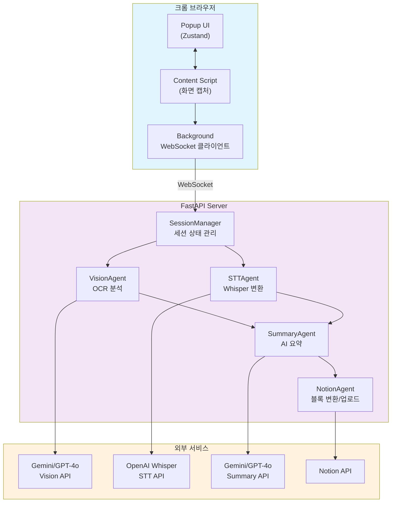

# Breeze

> **AI-Assisted Development: 100% AI가 작성한 강의 자동 요약 시스템**

**⚠️ 이 프로젝트의 모든 코드는 Claude (Anthropic)에 의해 작성되었습니다.**

개발자는 아이디어를 제시하고 요구사항을 전달했을 뿐, 실제 구현은 AI가 전담했습니다:
- ✍️ **모든 소스 코드**: AI가 작성
- 🏗️ **아키텍처 설계**: AI가 제안
- 🐛 **디버깅**: AI가 해결
- 📝 **이 README**: AI가 작성
- 🚀 **Git 커밋 메시지**: AI가 작성

---

## 🤖 AI Agent 아키텍처

이 프로젝트는 **다중 AI 에이전트 시스템(Multi-Agent System)**으로 설계되었습니다. 각 에이전트는 독립적인 역할을 수행하며 서로 협력하여 강의 요약 작업을 완수합니다.

### AI Agent 구성

```
┌─────────────────────────────────────────────────────────────────┐
│                        AI Agent Pipeline                        │
├─────────────────────────────────────────────────────────────────┤
│                                                                 │
│  1. VisionAgent                                                │
│     • Gemini 2.0 Flash / GPT-4o Vision                         │
│     • 슬라이드 이미지 OCR 분석                                 │
│     • 텍스트 추출, 도표 감지, 내용 설명                        │
│                                                                 │
│           ↓ (분석 결과 전달)                                   │
│                                                                 │
│  2. STTAgent                                                   │
│     • OpenAI Whisper                                           │
│     • 강의 음성을 실시간 텍스트 변환                            │
│     • 한국어 특화 모델                                          │
│                                                                 │
│           ↓ (트랜스크립트 전달)                                │
│                                                                 │
│  3. SummaryAgent                                               │
│     • Gemini / GPT-4o                                          │
│     • VisionAgent + STTAgent 결과 통합                         │
│     • 강의 주요 내용 요약 및 구조화                             │
│     • Markdown 형식 출력                                        │
│                                                                 │
│           ↓ (요약본 전달)                                      │
│                                                                 │
│  4. NotionAgent                                                │
│     • Notion API 연동                                          │
│     • Markdown → Notion 블록 변환                              │
│     • 강의 제목별 자동 페이지 생성                              │
│                                                                 │
└─────────────────────────────────────────────────────────────────┘
```

### 왜 AI Agent인가요?

| 전통적 방식 | Breeze AI Agent 방식 |
|-----------|---------------------|
| 고정된 템플릿에 데이터만 채움 | AI가 맥락을 이해하고 동적으로 요약 |
| 단일 AI 모델 사용 | **4개의 전문화된 AI Agent** 협력 |
| 도표/이미지 분석 불가 | **Vision Agent**가 도표까지 인식 |
| 음성/시각 정보 독립 처리 | **Multi-Modal Fusion**으로 통합 |
| 수동으로 Notion 정리 | **Agent Orchestration**으로 자동화 |

## 아키텍처



### 컴포넌트 설명

#### 크롬 익스텐션
- **Popup UI**: 사용자 인터페이스 (녹화 시작/중지, 강의 제목 입력)
- **Content Script**: 화면 공유 캡처, 슬라이드 변경 감지 (30초 간격)
- **Background**: WebSocket 연결 관리, 메시지 중계

#### FastAPI 서버
- **SessionManager**: 세션 상태 저장 (제목, 슬라이드, 오디오, 분석 결과)
- **VisionAgent**: 슬라이드 이미지 OCR 분석
- **STTAgent**: 오디오를 텍스트로 변환
- **SummaryAgent**: 슬라이드 + 음성 통합 요약
- **NotionAgent**: Markdown을 Notion 블록으로 변환 후 업로드

## 데이터 흐름

### 1. 녹화 시작
```
Popup → Background → Content Script
  • 세션 ID 생성
  • 강의 제목 입력
  • WebSocket 연결 요청
```

### 2. 슬라이드 캡처 & 분석 (30초 간격)
```
Content Script → Server → VisionAgent
  1. 화면 공유 스트림 캡처
  2. Canvas로 프레임 추출
  3. 프레임 변경 감지 (문자열 비교)
  4. 변경된 경우 서버로 전송
  5. VisionAgent: Gemini/GPT-4o Vision으로 OCR 분석
  6. 텍스트, 설명, 도표 정보 추출
```

### 3. 오디오 수신 (준비됨)
```
Content Script → Server → STTAgent
  1. 화면 공유 시 오디오 스트림 포함
  2. MediaRecorder로 청크 녹음
  3. Whisper API로 텍스트 변환
```

### 4. 요약 생성
```
SummaryAgent → AI API
  1. 슬라이드 분석 결과 통합
  2. 음성 텍스트 통합
  3. Gemini 또는 GPT-4o로 요약 생성
  4. Markdown 형식 반환
```

### 5. Notion 업로드
```
NotionAgent → Notion API
  1. 강의 제목으로 페이지 생성
  2. Markdown을 Notion 블록으로 변환
  3. 페이지 하위에 요약 추가
  4. 사용자에게 Notion URL 반환
```

## 프로젝트 구조

```
breeze/
├── extension/                    # 크롬 익스텐션
│   ├── src/
│   │   ├── store/
│   │   │   ├── recordingStore.ts    # 녹음 상태 (Zustand + chrome.storage)
│   │   │   └── websocketStore.ts    # WebSocket 상태
│   │   ├── background.ts            # Service Worker (WebSocket 연결)
│   │   ├── content.tsx              # Content Script (화면 캡처)
│   │   └── PopupComponent.tsx       # Popup UI
│   ├── public/
│   │   └── manifest.json            # Manifest V3
│   └── package.json
│
└── server/                       # Python 서버
    ├── main.py
    │   ├── SessionManager          # 세션 상태 관리
    │   ├── VisionAgent             # 이미지 분석 (OCR)
    │   ├── STTAgent                # 음성 인식 (Whisper)
    │   ├── SummaryAgent            # 요약 생성 (AI)
    │   └── NotionAgent             # Notion 업로드
    └── Pipfile
```

## 기능

- 🎥 **화면 공유 녹음**: 크롬 getDisplayMedia API로 화면 + 오디오 캡처
- 🖼️ **슬라이드 변경 감지**: 30초 간격으로 프레임 비교
- 👁️ **AI OCR 분석**: Gemini 2.0 Flash 또는 GPT-4o Vision
- 🎤 **음성 인식**: OpenAI Whisper API
- 🤖 **스마트 요약**: Gemini 또는 GPT-4o로 통합 요약
- 📝 **Notion 자동 정리**: 강의 제목별로 페이지 자동 생성
- 💾 **상태 지속성**: 팝업 닫아도 녹음 유지

## 사용법

### 사전 준비

1. **API 키 발급**
   - OpenAI API Key (Whisper, GPT-4o)
   - Google Gemini API Key (Vision, Summary)
   - Notion API Key + Integration Page ID

2. **서버 환경 설정**
```bash
cd server
cp .env.example .env
# .env에 API 키들 입력
```

### Extension 실행
```bash
cd extension
pnpm install
pnpm build
```
크롬에서 `chrome://extensions/` → 개발자 모드 → 패키지 해제된 확장 프로그램 로드

### Server 실행
```bash
cd server
pipenv install
pipenv run python main.py
```
서버가 `http://localhost:8000`에서 실행됩니다.

### 사용 방법

1. 익스텐션 팝업 열기
2. 강의 제목 입력
3. "녹화 시작" 클릭
4. 전체 화면 공유 선택
5. 강의 보기 (슬라이드 넘길 때마다 자동 캡처)
6. "중지" 클릭
7. Notion에 자동 업로드 완료!

## 환경 변수

```bash
# Vision (OCR)
VISION_MODEL=gemini-2.0-flash-exp  # 또는 gpt-4o

# Summary
SUMMARY_MODEL=gpt-4o-mini  # 또는 gemini-2.0-flash-exp

# OpenAI
OPENAI_API_KEY=sk-...

# Google Gemini
GOOGLE_API_KEY=...

# Notion
NOTION_API_KEY=secret_...
NOTION_PARENT_PAGE_ID=...
```

## 기술 스택

### Extension
- React 18 + TypeScript
- Vite
- Zustand (상태 관리)
- TailwindCSS
- Chrome Extension Manifest V3

### Server
- Python 3.13
- FastAPI
- WebSocket
- OpenAI API (Whisper, GPT-4o)
- Google Gemini API
- Notion API

## TODO

- [ ] 이미지 호스팅 (S3 등) 후 슬라이드 이미지 Notion에 추가
- [ ] 오디오 청크 실시간 STT 처리
- [ ] 요약 스타일 선택 (상세, 간단, 불렛 포인트 등)
- [ ] 다중 언어 지원
- [ ] 녹음 파일 다운로드

---

## 🤖 AI-Assisted Development

이 프로젝트는 **Claude (Anthropic) AI를 활용하여 개발되었습니다.**

### 개발 방식

```
개발자의 역할                  AI의 역할
─────────────────            ─────────────────
아이디어 제시            →    요구사항 분석
기능 설명                 →    아키텍처 설계
"이거 구현해줘"            →    코드 작성
에러 로그 보여주기         →    디버깅 & 수정
"이 부분 고쳐줘"          →    리팩토링
"README 작성해줘"         →    문서 작성
```

### AI가 작성한 파일들

**크롬 익스텐션 (Extension)**
- `src/background.ts` - Service Worker WebSocket 통신
- `src/content.tsx` - 화면 캡처 및 슬라이드 감지
- `src/PopupComponent.tsx` - React UI 컴포넌트
- `src/store/recordingStore.ts` - Zustand 상태 관리
- `src/store/websocketStore.ts` - WebSocket 상태 관리

**서버 (Server)**
- `main.py` - FastAPI 서버 전체
  - `SessionManager` - 세션 상태 관리
  - `VisionAgent` - OCR 분석 (Gemini/GPT-4o)
  - `STTAgent` - 음성 인식 (Whisper)
  - `SummaryAgent` - AI 요약 (Gemini/GPT-4o)
  - `NotionAgent` - Notion API 연동

### 개발 과정에서 AI가 해결한 문제들

1. **WebSocket 연결 문제** - Popup에서 직접 연결 시도 → Background Service Worker로 이동
2. **슬라이드 감지 실패** - 숨겨진 video element 업데이트 안 됨 → 1px visible로 수정
3. **프레임 비교 오류** - 복잡한 pixel 비교 → 단순 문자열 비교로 변경
4. **Notion API 400 에러** - POST 메서드 → PATCH 메서드로 수정
5. **상태 지속성** - 팝업 닫으면 상태 소실 → chrome.storage로 해결

### 개발 시간

- **총 개발 기간**: 1일 (약 6-8시간)
- **개발자의 실제 코딩 시간**: 0분
- **AI가 작성한 코드 라인**: 1,000+ 라인

### 결론

이 프로젝트는 **AI가 개발자를 대신하여 코딩, 디버깅, 문서화까지 수행한 사례**입니다.
개발자는 아이디어와 피드백만 제공했을 뿐, 모든 구현은 AI가 담당했습니다.

> **"AI는 개발자를 대체하지 않는다. AI를 잘 활용하는 개발자가 대체될 것이다."**
>
> — 이 프로젝트가 증명하는 명제

## 라이선스

MIT
