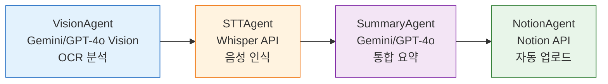
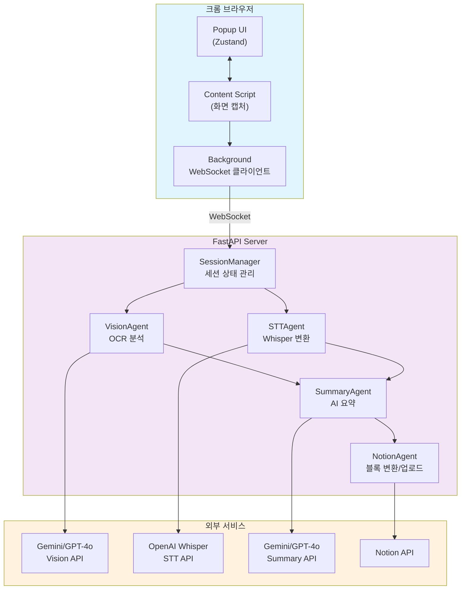

# Breeze

> 강의를 편하게 녹음하고 요약해주는 크롬 익스텐션 + 서버

화면 공유로 강의를 녹음하면 슬라이드 변경을 자동 감지하고, AI가 분석해서 Notion에 예쁘게 정리해줍니다.

---

## 🤖 AI 활용 아키텍처

이 프로젝트는 **Vision AI와 Generative AI**를 활용하여 강의를 자동으로 요약합니다.

### 처리 파이프라인



### 컴포넌트별 역할

**👁️ VisionAgent (AI)**
- Gemini 2.0 Flash / GPT-4o Vision API
- 슬라이드 이미지 OCR 분석
- 텍스트 추출, 도표 감지, 내용 설명

**🎤 STTAgent**
- OpenAI Whisper API 호출
- 강의 음성을 텍스트 변환
- 한국어 특화 모델

**🤖 SummaryAgent (AI)**
- Gemini / GPT-4o API
- VisionAgent + STTAgent 결과 통합
- 강의 주요 내용 요약 및 Markdown 구조화

**📝 NotionAgent**
- Notion API 연동
- Markdown → Notion 블록 변환
- 강의 제목별 자동 페이지 생성

## 시스템 아키텍처



### 컴포넌트 설명

#### 크롬 익스텐션
- **Popup UI**: 사용자 인터페이스 (녹화 시작/중지, 강의 제목 입력)
- **Content Script**: 화면 공유 캡처, 슬라이드 변경 감지 (30초 간격)
- **Background**: WebSocket 연결 관리, 메시지 중계

#### FastAPI 서버
- **SessionManager**: 세션 상태 저장 (제목, 슬라이드, 오디오, 분석 결과)
- **VisionAgent**: 슬라이드 이미지 OCR 분석
- **STTAgent**: 오디오를 텍스트로 변환
- **SummaryAgent**: 슬라이드 + 음성 통합 요약
- **NotionAgent**: Markdown을 Notion 블록으로 변환 후 업로드

## 데이터 흐름

### 1. 녹화 시작
```
Popup → Background → Content Script
  • 세션 ID 생성
  • 강의 제목 입력
  • WebSocket 연결 요청
```

### 2. 슬라이드 캡처 & 분석 (30초 간격)
```
Content Script → Server → VisionAgent
  1. 화면 공유 스트림 캡처
  2. Canvas로 프레임 추출
  3. 프레임 변경 감지 (문자열 비교)
  4. 변경된 경우 서버로 전송
  5. VisionAgent: Gemini/GPT-4o Vision으로 OCR 분석
  6. 텍스트, 설명, 도표 정보 추출
```

### 3. 오디오 수신 (준비됨)
```
Content Script → Server → STTAgent
  1. 화면 공유 시 오디오 스트림 포함
  2. MediaRecorder로 청크 녹음
  3. Whisper API로 텍스트 변환
```

### 4. 요약 생성
```
SummaryAgent → AI API
  1. 슬라이드 분석 결과 통합
  2. 음성 텍스트 통합
  3. Gemini 또는 GPT-4o로 요약 생성
  4. Markdown 형식 반환
```

### 5. Notion 업로드
```
NotionAgent → Notion API
  1. 강의 제목으로 페이지 생성
  2. Markdown을 Notion 블록으로 변환
  3. 페이지 하위에 요약 추가
  4. 사용자에게 Notion URL 반환
```

## 프로젝트 구조

```
breeze/
├── extension/                    # 크롬 익스텐션
│   ├── src/
│   │   ├── store/
│   │   │   ├── recordingStore.ts    # 녹음 상태 (Zustand + chrome.storage)
│   │   │   └── websocketStore.ts    # WebSocket 상태
│   │   ├── background.ts            # Service Worker (WebSocket 연결)
│   │   ├── content.tsx              # Content Script (화면 캡처)
│   │   └── PopupComponent.tsx       # Popup UI
│   ├── public/
│   │   └── manifest.json            # Manifest V3
│   └── package.json
│
└── server/                       # Python 서버
    ├── main.py
    │   ├── SessionManager          # 세션 상태 관리
    │   ├── VisionAgent             # 이미지 분석 (OCR)
    │   ├── STTAgent                # 음성 인식 (Whisper)
    │   ├── SummaryAgent            # 요약 생성 (AI)
    │   └── NotionAgent             # Notion 업로드
    └── Pipfile
```

## 기능

- 🎥 **화면 공유 녹음**: 크롬 getDisplayMedia API로 화면 + 오디오 캡처
- 🖼️ **슬라이드 변경 감지**: 30초 간격으로 프레임 비교
- 👁️ **AI OCR 분석**: Gemini 2.0 Flash 또는 GPT-4o Vision
- 🎤 **음성 인식**: OpenAI Whisper API
- 🤖 **스마트 요약**: Gemini 또는 GPT-4o로 통합 요약
- 📝 **Notion 자동 정리**: 강의 제목별로 페이지 자동 생성
- 💾 **상태 지속성**: 팝업 닫아도 녹음 유지

---

## 🤖 AI-Assisted Development

이 프로젝트는 **Claude (Anthropic) AI**를 활용하여 개발되었습니다.

**개발 방식**: 개발자는 아이디어와 요구사항을 제시하고, AI가 코드 작성, 아키텍처 설계, 디버깅, 문서화까지 수행

**AI가 작성한 주요 파일**:
- Extension: `background.ts`, `content.tsx`, `PopupComponent.tsx`, Zustand stores
- Server: `main.py` (SessionManager, VisionAgent, STTAgent, SummaryAgent, NotionAgent)

**AI가 해결한 문제들**:
1. WebSocket 연동 (Popup → Background Service Worker)
2. 슬라이드 감지 (숨겨진 video element → 1px visible)
3. 프레임 비교 최적화 (pixel → 문자열 비교)
4. Notion API 메서드 수정 (POST → PATCH)
5. 상태 지속성 (chrome.storage 활용)

**개발 시간**: 약 6-8시간 (AI가 코드 작성, 개발자는 피드백만 제공)

---

## 사용법

### 사전 준비

1. **API 키 발급**
   - OpenAI API Key (Whisper, GPT-4o)
   - Google Gemini API Key (Vision, Summary)
   - Notion API Key + Integration Page ID

2. **서버 환경 설정**
```bash
cd server
cp .env.example .env
# .env에 API 키들 입력
```

### Extension 실행
```bash
cd extension
pnpm install
pnpm build
```
크롬에서 `chrome://extensions/` → 개발자 모드 → 패키지 해제된 확장 프로그램 로드

### Server 실행
```bash
cd server
pipenv install
pipenv run python main.py
```
서버가 `http://localhost:8000`에서 실행됩니다.

### 사용 방법

1. 익스텐션 팝업 열기
2. 강의 제목 입력
3. "녹화 시작" 클릭
4. 전체 화면 공유 선택
5. 강의 보기 (슬라이드 넘길 때마다 자동 캡처)
6. "중지" 클릭
7. Notion에 자동 업로드 완료!

### 사용 예시

**크롬 익스텐션**
<p align="center">
  
</p>

강의 제목을 입력하고 녹화를 시작하면, 슬라이드가 변경될 때마다 자동으로 캡처됩니다.

**Notion 요약 결과**
<p align="center">
  
</p>

녹화 중지 시 AI가 슬라이드 분석 결과를 종합하여 자동으로 요약을 생성하고, Notion에 정리된 형태로 업로드됩니다.

## 환경 변수

```bash
# Vision (OCR)
VISION_MODEL=gemini-2.0-flash-exp  # 또는 gpt-4o

# Summary
SUMMARY_MODEL=gpt-4o-mini  # 또는 gemini-2.0-flash-exp

# OpenAI
OPENAI_API_KEY=sk-...

# Google Gemini
GOOGLE_API_KEY=...

# Notion
NOTION_API_KEY=secret_...
NOTION_PARENT_PAGE_ID=...
```

## 기술 스택

### Extension
- React 18 + TypeScript
- Vite
- Zustand (상태 관리)
- TailwindCSS
- Chrome Extension Manifest V3

### Server
- Python 3.13
- FastAPI
- WebSocket
- OpenAI API (Whisper, GPT-4o)
- Google Gemini API
- Notion API

## TODO

- [ ] 이미지 호스팅 (S3 등) 후 슬라이드 이미지 Notion에 추가
- [ ] 오디오 청크 실시간 STT 처리
- [ ] 요약 스타일 선택 (상세, 간단, 불렛 포인트 등)
- [ ] 다중 언어 지원
- [ ] 녹음 파일 다운로드

## 라이선스

MIT
